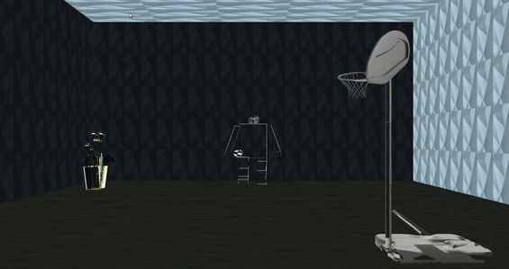
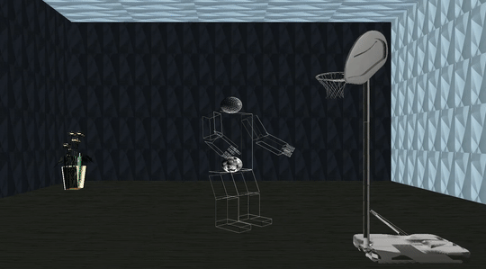
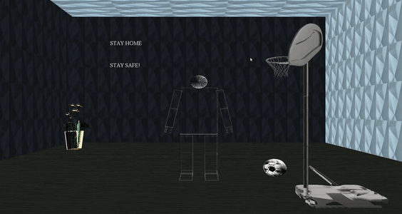

# **Graphics-final-project**

# **Group ID: 9**


  Name    |  SEC     |  BN   | MAIL  
---|---|---|---|---  
  Mariam Ahmed | 2 | 29 | mariem.ahmed.16@gmail.com  
  Esraa Sayed  | 1 | 12 | sayedesraa645@gmail.com  
  Al-Zahraa Eid  |  1 | 16  |  alzahraaeid62@gmail.com  
  Mohamed Almotasem | 2 | 18  | mohammed.almotasem55@googlemail.com  
  Galal Hossam El-Dein | 1 | 26  | galalhossam555@gmail.com

### *Repository Link:*
```
https://github.com/Almotasem100/Graphics-final-
```
<!-- MarkdownTOC -->
  - [Robot with Animation Graphics:](#Robot-with-Animation-Graphics:)
    - [Files written](#Files-written)
  - [List of Commands](#List-of-Commands)
    - [Commands to generate the compiled file and run it](#Commands-to-generate-the-compiled-file-and-run-it)
    - [List of commands to control the body](#List-of-Commands-to-control-the-body)
    - [List of commands to control the camera](#List-of-Commands-to-control-the-camera)
    - [List of commands to control the animations](#List-of-Commands-to-control-the-animations)
  - [Functions Implemnted that satisfy the requirements](#Functions-Implemnted-that-satisfy-the-requirements)
    - [initRendering() Function](#initrendering-function)
    - [loadTexture() Function](#loadtexture-function)
    - [floorTexture() Function](#floortexture-function)
    - [drawmodel1() Function](#drawmodel1-function)
    - [display() Function](#display-function)
    - [screen_menu Function](#screen_menu-function)
    - [timer() Function](#timer-function)
    - [timerica() Function](#timerica-function)
    - [timer3() Function](#timer3-function)
<!-- MarkdownTOC -->

# Robot with Animation Graphics
the aim of the task is to implement the full body of a robot, add the control and limitations to its movements, control the camera and the view prospective using the arrows and the mouse, get more familiar with the concepts of textures-lightening-and shading, add a drop menu to interact with these texture, import certain objects and implement animations to the robot where one of those animations is to be where the robot interacts with one of the objects.
## Files written:

* ReadMe.md: the markdown file contain the description of the task
* SBE306B_Spring20_Project_Group_09.cpp.cpp: a c++ file that contain the code implemntation to the robot figure, the movement shortcuts and limitations, controlling texture, importing objects and generating animations 
* SBE306B_Spring20_Project_Group_09: file generarted to run the program with
* imageloader.cpp / glm.cpp : c++ libraries used in importion the textures and objects
* data folder: a folder holds the different textures for the user to choose within
* objects folder: a folder holds the objects imported in the project

# List of Commands
## Commands to generate the compiled file and run it
```
g++ -o SBE306B_Spring20_Project_Group_09 SBE306B_Spring20_Project_Group_09.cpp imageloader.cpp glm.cpp -lGL -lglut -lGLU -lm
```
```
./SBE306B_Spring20_Project_Group_09
```
## List of commands to control the body:
* rotate Shoulder:
  * in x-direction: q,Q
  * in y-directioc: a,A
  * in z- direction: s,S

* rotate Elbow : e,E

* rotate fingers: g,G

* rotate Legs:
  * right:  
      * in x-direction: y,y
      * in z-direction: u,U
  * left:   
      * in x-direction: t,T
      * in z-directtion: i,I

* rotate Knee: 
    * left: h,H
    * right: j,J
                                                  
* rotate Body around it's Axis : b,B
## List of commands to control the camera:
* Up/Down arrows or mouse movement vertically: to move the camera upwards and downwards
* Right/Left arrows or mouse movement horizontally: to move the camera right and left
* 'f'/'b' keybuttons: to move the camera forward and backwards
## List of commands to control the animations
* 'z': to command the robot to make a 3 point basketball shot
* 'Z': to command the robot to wave to the public while dispalying an advice to the them

# Functions Implemnted that satisfy the requirements
## initRendering() Function:


This function loads the image data and adjusts the lightning of the room.

```
void initRendering()
{
   if (!image) {
		image = loadBMP("data/floor.bmp");
   if (!image) exit(0);
	}
   _textureId = loadTexture(image);
   delete image;
   // Turn on the power
   glEnable(GL_LIGHTING);
   // Flip light switch
   glEnable(GL_LIGHT0);
   glEnable(GL_LIGHT1);
   // assign light parameters
   glLightfv(GL_LIGHT0, GL_AMBIENT, light_ambient);
   glLightfv(GL_LIGHT0, GL_DIFFUSE, light_diffuse);
   glLightfv(GL_LIGHT0, GL_SPECULAR, light_specular);
   glLightfv(GL_LIGHT1, GL_AMBIENT, light_ambient);
   glLightfv(GL_LIGHT1, GL_DIFFUSE, light_diffuse);
   glLightfv(GL_LIGHT1, GL_SPECULAR, light_specular);
   // Material Properties         
   glMaterialfv(GL_FRONT_AND_BACK, GL_AMBIENT_AND_DIFFUSE,mat_amb_diff);
   glMaterialfv(GL_FRONT, GL_SPECULAR, mat_specular);
   glMaterialfv(GL_FRONT, GL_SHININESS, shininess);
   GLfloat lightColor1[] = {1.0f, 1.0f,  1.0f, 1.0f };
   glLightfv(GL_LIGHT1, GL_DIFFUSE, lightColor1);
   glLightfv(GL_LIGHT1, GL_POSITION, lightPos1);
   glLightfv(GL_LIGHT0, GL_DIFFUSE, lightColor1);
   glEnable(GL_NORMALIZE);
   //Enable smooth shading
   glShadeModel(GL_SMOOTH);
   // Enable Depth buffer
   glEnable(GL_DEPTH_TEST);
}
```

## loadTexture() Function:


This function take the image data and maps it to the texture generated and returns the texture id.

```
GLuint loadTexture(Image* image) {
      GLuint textureId;
      glGenTextures(1, &textureId);
      glBindTexture(GL_TEXTURE_2D, textureId);
      glTexImage2D(GL_TEXTURE_2D,0,GL_RGB,image->width,image->height,0,GL_RGB, GL_UNSIGNED_BYTE,image->pixels);
      return textureId;
}
```


## floorTexture() Function:


By calling the **loadTexture()** function, it takes the texture id to draw the room floor and walls and puts the textures on them.

```
void floorTexture()
{
    glPushMatrix();
    glEnable(GL_TEXTURE_2D);

    glBindTexture(GL_TEXTURE_2D, loadTexture(loadBMP("data/floor5.bmp")));
    glTexParameteri(GL_TEXTURE_2D, GL_TEXTURE_MIN_FILTER, GL_NEAREST);
    glTexParameteri(GL_TEXTURE_2D, GL_TEXTURE_MAG_FILTER, GL_NEAREST);
    glTexParameteri(GL_TEXTURE_2D, GL_TEXTURE_MIN_FILTER, GL_LINEAR);
    glTexParameteri(GL_TEXTURE_2D, GL_TEXTURE_MAG_FILTER, GL_LINEAR);

    glBegin(GL_QUADS);      
    glNormal3f(0.0,-1.0,0.0);
    glTexCoord2f(0.0f, 0.0f);
    glVertex3f(-10,10,10);
    glTexCoord2f(5.0f,  0.0f);
    glVertex3f(10,10,10);
    glTexCoord2f(5.0f,  20.0f);
    glVertex3f(10,10,-10);
    glTexCoord2f(0.0f, 20.0f);
    glVertex3f(-10,10,-10);
    glEnd();
    .
    .
    .
    glDisable(GL_TEXTURE_2D);
    glPopMatrix();
}
```

## drawmodel1() Function:


This function takes the objects path to display them.

```
void drawmodel1( char* name)
{
	pmodel = glmReadOBJ(name);
	if (!pmodel) exit(0);
	glmUnitize(pmodel);
	glmFacetNormals(pmodel);
	glmVertexNormals(pmodel, 90.0);
	glmScale(pmodel, .15);

	glmDraw(pmodel, GLM_SMOOTH | GLM_MATERIAL);
}

```

## display() Function:


In this function we adjust the objects locations in the room and calls the robot function to display it.
```
void display(void)
{
  glClear(GL_COLOR_BUFFER_BIT | GL_DEPTH_BUFFER_BIT);
  glClearColor(0.0, 0.0, 0.0, 0.0);
  glMatrixMode(GL_MODELVIEW);
  glShadeModel(GL_FLAT);
  glLoadIdentity();
  gluLookAt(eye[0], eye[1], eye[2], center[0], center[1], center[2], up[0], up[1], up[2]);
  glPushMatrix();
  glLightfv(GL_LIGHT1, GL_POSITION, lightPos1);
  glLightfv(GL_LIGHT0, GL_POSITION, light_position);
  glPopMatrix();
  //materials properties
  glMaterialfv(GL_FRONT_AND_BACK, GL_AMBIENT_AND_DIFFUSE,mat_amb_diff);
  glMaterialfv(GL_FRONT, GL_SPECULAR, mat_specular);
  glMaterialfv(GL_FRONT, GL_SHININESS, shininess);
  glPushMatrix();
  glTranslatef(0, 0, -1);
  floorTexture();
  glPushMatrix();
  glTranslatef(3.1, -0.1, 4.2);
  glRotatef(-90,1,0,0);
  glRotatef(-90,0,0,1);
  glScalef(20,20,20);
  drawmodel1("objects/10488_basketball_goal_L3.obj");
  glPopMatrix();

  glPushMatrix();
  glTranslatef(-12, -2, -15);
  glScalef(20,20,20);
  drawmodel1("objects/flowers.obj");		
  glPopMatrix();
  glPopMatrix();
  robot();
  glPopMatrix();
  if (flage)
  {
    s=0;
    glPushMatrix();
    glRotatef((GLfloat) ball, 1.0, 0.0, -1.0);
    glTranslatef(XX, YY, ZZ);	            
    glScalef(s2,s2,s2);
    drawmodel1("objects/soccerball.obj");		
    glPopMatrix();            
  }
  if (flage2)
  {
    s=0;
    glPushMatrix();
    glTranslatef(2, -2, 3);	            
    glScalef(2,2,2);
    drawmodel1("objects/soccerball.obj");		
    glPopMatrix();          
  }
  glutSwapBuffers();
}  
```

## screen_menu Function:

This function helps us to change the floor texture we click on the right mouse button

```
void screen_menu(int value)
{
  switch (value) {
  case 1:
    image = loadBMP("data/floor.bmp");
    break;
  case 2:
    image = loadBMP("data/floor2.bmp");
    break;
  case 4:
    image = loadBMP("data/floor4.bmp");
    break;
  case 5:
    image = loadBMP("data/floor3.bmp");
    break;
  case 6:
    image = loadBMP("data/floor6.bmp");
    break;
  case 7:
    image = loadBMP("data/floor7.bmp");
    break;
	}
	if (!image) exit(0);
  initRendering();
  glutPostRedisplay();
}
```

## timer() Function:

This function makes the 1st animation in which the robot moves along the room.
```
void timer(int)
{        
  if (z <0)
  {
    z+=0.1;                                           
    switch(statez)
    {
      case 1:               
        legx+=5;
        legx2-=5;
        if (legx >45)
          statez =-1;            
          break;    
      case -1:               
        legx-=5;
        legx2+=5;               
        if (legx<-45)
          statez=1;
          break;        
    }
    glutTimerFunc(1000/60, timer ,0);        
  }             
  else
  {  
    legx=0;
    legx2=0;                  
  }    
  glutPostRedisplay();   
}
```


##  timerica() Function:


This function makes the 2nd animation in which the robot throw the basketball in the basketball hoop by pressing "z" key.
```
void timerica(int)
{  
  body = 45;
  switch (state)
  {  
    case 0:
    {
       if(legx > -60)
       {
          legx -= step_j;
          legx2 -= step_j;
          knee += step_j;
          knee2 += step_j;
          shoulderlx += step_j;
          shoulderrx -= step_j;
          elbow += 2*step_j;
          elbow2 -= 2*step_j;
          if(legx < -15)
          elevation -= 0.01;
       }
       else
          state = 1;
    }break;
    case 1:
    {
       if(legx < -15)
       {
          legx += step_j;
          legx2 += step_j;
          knee -= step_j;
          knee2 -= step_j;
          shoulderlx += step_j;
          shoulderrx -= step_j;
          elevation += 0.03;
       }
       else
          state = 2;
    }break;
    case 2:
    {
       if(legx < 0)
       {
          legx += step_j;
          legx2 += step_j;
          knee -= step_j;
          knee2 -= step_j;
          shoulderlx += step_j;
          shoulderrx -= step_j;
          elbow -= 4*step_j;
          elbow2 += 4*step_j;
          elevation += 0.03;
       }
       else
        {
          state = 3;
        }
    }break;
    case 3:
    {
       if(elevation > 0.025)
       {
          elevation -= 0.025;
          if(ball < 44)
          ball+=4;
          else if(YY>0){
             YY -= 0.7;
             XX += 0.3;
             ZZ += 0.3;}
          flage=1;
          if(elbow > 0)
          {
             elbow -= step_j;
             elbow2 += step_j;               
          }
          if(shoulderlx > 0)
          {
             shoulderlx -= step_j;
             shoulderrx += step_j;
          }
       }
       else
          state = 4;
    }
    case 4:
    {
       if(elbow > 0)
       {
          elbow -= step_j;
          elbow2 += step_j;            
       }
       if(shoulderlx > 0)
       {
          shoulderlx -= step_j;
          shoulderrx += step_j;
       }
       if (elbow == 0 && shoulderlx == 0)
       {
          state = 5;
          elevation = 0;
       }
    }
  }
  glutPostRedisplay();   
  if(state == 5)
    state = 0;
  else
    glutTimerFunc(5, timerica, 0);   
}
```


## timer3() Function:


This fuction makes the 3rd animation in which the robot waves his hand and displays a message by pressing "v" key.
```
void timer3(int)
{
  glutTimerFunc(1000/60, timer3 ,0);
  glutPostRedisplay();
  body=0;
  s=0;
  s2=0;
  flage2=1;
  switch (state3)
  {
    case 0:
    {
    if(shoulderlx < 155)
    {
        shoulderlx = (shoulderlx + 5);
        shoulderrx = (shoulderrx - 5);
    }
    if(elbowx < 85)
    {
       elbowx = elbowx + 5;
       elbowx2 = elbowx2 + 5;
    }
    if(shoulderlz > -90)
    {
       shoulderlz = (shoulderlz - 5);
       shoulderrz = (shoulderrz + 5);
    }
    if (shoulderlx==155 && elbowx==85 && shoulderlz==-90)
        state3=1;
    }
    break;
    case 1:
       {  
          if(shoulderlz < -75)
          {
             shoulderlz = (shoulderlz + 5);
             shoulderrz = (shoulderrz - 5);
          }
          else
             state3=2;
      }
    break;
    case 2:
       {
          if(shoulderlz > -140)
          {
           shoulderlz = (shoulderlz - 5);
           shoulderrz = (shoulderrz + 5);
          }
          else
            state3=1;
       }
    break;
    default:
       break;
   }
```

